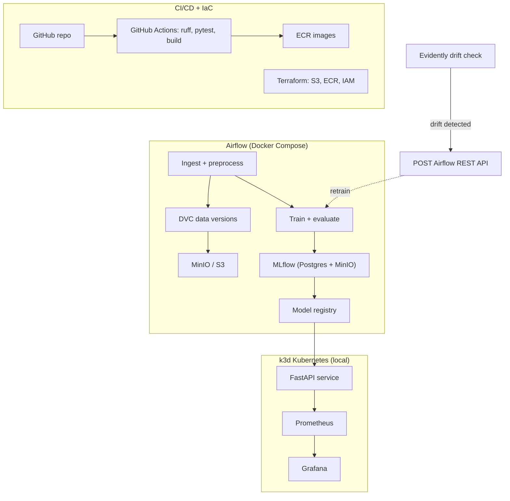

# End-to-End MLOps Pipeline

A production-grade MLOps reference implementation: reproducible data and training
pipelines, experiment tracking, CI/CD, monitored model serving on Kubernetes, and a
closed loop that retrains automatically when drift is detected.

The ML model is deliberately simple - LightGBM on tabular data, training in under 30
seconds. The engineering around it is the project: orchestration, versioning,
automation, observability, and the switches that take the same code from a laptop to
AWS with near-zero cloud spend.

## Architecture



## Tech stack

| Concern | Tool |
| --- | --- |
| Orchestration | Apache Airflow 3.x (Docker Compose) |
| Data & pipeline versioning | DVC — MinIO locally, S3 in cloud |
| Experiment tracking & registry | MLflow (Postgres backend, server-proxied artifacts) |
| Serving | FastAPI container on k3d Kubernetes (Helm) |
| Infrastructure as code | Terraform — S3, ECR, least-privilege IAM |
| CI/CD | GitHub Actions — lint, test, buildx, push to ECR |
| Monitoring | Evidently (drift) + Prometheus / Grafana (API telemetry) |
| GitOps (planned) | ArgoCD sync into k3d |

## Design decisions

- **Local-first, cloud-ready.** Everything runs on Docker Compose and k3d; the AWS
  footprint is limited to S3, ECR, and a one-off ECS Fargate demo. MinIO speaks the S3
  API, so the storage code path is identical locally and in the cloud — switching is an
  endpoint and credentials, not a rewrite.
- **Kubernetes over managed container services.** Serving runs on k3d with real
  Deployment/Service/HPA manifests and a Helm chart — portable skills and
  production-shaped configuration instead of a proprietary abstraction.
- **MLflow on Postgres, not SQLite.** Parallel Airflow tasks write concurrently;
  SQLite locks, Postgres doesn't.
- **Server-proxied artifacts.** Clients log to MLflow without holding any storage
  credentials — the server brokers all artifact traffic.
- **Lightweight model on purpose.** Fast training keeps the feedback loop on the
  pipeline, where the engineering value is.
- **DVC for versioning, not orchestration.** DVC's pipeline feature (`dvc repro`) overlaps
  with Airflow; running both would mean two dependency graphs over the same steps. DVC
  versions data and artifacts, Airflow orchestrates, MLflow records outcomes.
- **NYC Yellow Taxi data.** Chosen over Census or Credit Default because it has a real time
  axis: drift in Phase 5 comes from replaying later months, not from synthetically
  corrupting inputs.
- **Airflow resolves pinned data, it does not pull it.** Tasks use `dvc.api.get_url` to
  turn a committed `.dvc` pointer into an object URL and stream the parquet directly from
  storage — no second copy, no container-side cache, and the orchestrator never writes to
  the repository. A separate `minio-docker` remote exists solely because the same object
  store has a different address inside the Compose network.
- **The model excludes `trip_distance`.** It is the metered distance, known only after the
  trip, so using it to predict trip duration is leakage: a strong validation score with no
  deployment path. Features are restricted to what is known when a ride is requested, and a
  unit test enforces the exclusion list on every commit. Validation uses a temporal split
  for the same reason — production always means predicting forward.
- **Serving joins the cluster to the Compose network, because the signature says so.**
  MLflow 3 does not proxy artifact bytes: it redirects to a presigned
  `http://minio:9000/...` URL signed with `X-Amz-SignedHeaders=host`, so the Host header
  is inside the SigV4 signature and no ingress or port remap can rewrite it. Any client
  must reach a host literally named `minio` on port 9000, which is why the k3d cluster
  attaches to `mlops-pipeline_default` rather than talking to published host ports.
- **CI declares intent; it does not deploy.** The pipeline lints, tests, builds a
  multi-arch image, pushes it to GHCR, and then commits the new tag to the chart's
  `values.yaml`. Nothing in CI can reach the cluster — a hosted runner has no route to a
  laptop, and the alternatives (a tunnel, an exposed API server, a self-hosted runner
  holding cluster credentials) are all worse than the gap. `helm upgrade` runs locally
  against the committed value until Phase 7, when ArgoCD reads the same value and the
  pipeline does not change at all. The gap is the argument for GitOps, not an obstacle.
- **ECR gets a copy, never a rebuild.** A release tag copies the exact `linux/amd64`
  manifest already in GHCR, by digest, into ECR. Rebuilding at tag time would ship
  different bits from the ones verified on the cluster — same source, different base-image
  patch level. The tag names a commit whose `values.yaml` already points at a released
  image, so cutting a release means tagging the bump commit.
- **Serving holds no credentials, because the presigned URL is the credential.** The pod
  gets a ConfigMap with two URIs and no Secret: MLflow answers artifact requests with a
  presigned URL whose SigV4 signature travels in the query string, so the client never
  constructs an S3 request and never needs a key. Verified by loading the model with
  deliberately wrong `AWS_*` values and a bogus `MLFLOW_S3_ENDPOINT_URL` — it succeeded in
  1.53 s. The credential that does not exist cannot leak, expire, or need rotating.
- **The artifact path is bounded, because its failure mode is a stall, not an error.**
  MLflow's presigned download passes `timeout=None` and retries five times per file, so a
  misconfigured network hangs silently — ten minutes and zero bytes, measured. Serving caps
  each read with a socket timeout and the whole load with a hard wall-clock ceiling, so a
  bad network fails a readiness probe in seconds instead of hanging a rollout.
- **Retraining is a DAG with a threshold, and rejection is success.** The pipeline
  registers every candidate, re-scores the live champion on the candidate's validation
  rows, and moves the `@champion` alias only on a ≥1% MAE improvement. A run that
  correctly declines to promote ends green — failure is reserved for the pipeline actually
  breaking. Registry-mutating tasks never retry automatically.

## Cloud footprint and cost

The AWS layer is deliberately minimal and fully described in `infra/terraform/`:

| Resource | Purpose | Cost when idle |
| --- | --- | --- |
| S3 bucket | DVC remote | ~$0.02/GB-month, lifecycle rules cap growth |
| ECR repository | Inference API images | ~$0.10/GB-month, last 10 images retained |
| GitHub OIDC provider + IAM role | Keyless CI authentication | free |

No always-on compute is provisioned. The ECS Fargate demo in Phase 6 is applied and
destroyed in a single session.

Everything runs locally without an AWS account: MinIO stands in for S3, and k3d for
managed Kubernetes.

```bash
cd infra/terraform && terraform init && terraform plan
```

**Security posture:** CI authenticates via GitHub OIDC — no long-lived AWS keys exist
anywhere in the repo or in GitHub secrets. The IAM role is scoped to one repository, one
ECR repository, and one S3 bucket.

## Roadmap

| Phase | Scope | Status |
| --- | --- | --- |
| 1 | Local infra: Compose stack (MinIO, Postgres, MLflow, Airflow), Terraform, DVC, ingestion DAG | ✅ complete |
| 2 | Preprocess/train DAGs, MLflow tracking, model registry | ✅ complete |
| 3 | FastAPI serving on k3d, multi-stage Docker build, tests | ✅ complete |
| 4 | CI/CD with GitHub Actions | 🔨 in progress |
| 5 | Drift detection + automated retraining loop | planned |
| 6 | Hardening: secrets, IAM, security checklist, cost audit | planned |
| 7 | ArgoCD GitOps | planned |

## Quickstart (local)

Prerequisites: Docker Desktop, [uv](https://github.com/astral-sh/uv).
For the optional AWS layer: Terraform ≥ 1.11 and the AWS CLI.
On macOS also `brew install libomp` — LightGBM links the OpenMP runtime dynamically
and does not bundle it. The Airflow and serving images install the Linux equivalent
(`libgomp1`) for the same reason.
For Phase 3 serving: `brew install k3d helm` (kubectl is assumed).

`uv sync` builds the environment from `uv.lock`, an exact pinned resolution, and
fetches Python 3.11 if it is missing. Every project command runs through `uv run`,
so local and CI resolve to identical packages.

```bash
uv sync

cp .env.example .env        # set local passwords
docker compose up -d --build
uv run python scripts/smoke_mlflow.py
uv run dvc pull             # fetch the dataset (MinIO by default, `-r aws` for S3)
```

UIs: MLflow at http://localhost:5001 · MinIO console at http://localhost:9001 ·
Airflow at http://localhost:8080

### Serving (Phase 3, complete)

Promotion is verified by `/model`'s `run_id` following the `@champion` alias, not by
prediction values changing: v1 and v4 are numerically identical models (deterministic
training over the same pinned data), so identical predictions after a flip are the correct
result. A prediction-visible promotion needs Phase 5's drift data.

The Helm chart is the only definition of the deployment. The raw Kubernetes manifests
that preceded it were deleted once the chart reproduced them; they are in git history at
`459c389` (`k8s/`) if you want to compare the two forms. Keeping both would have
guaranteed drift the moment ArgoCD started syncing the chart.

`make help` lists the targets. M1 (app on the Compose network), M2 (cluster + egress
proven from an in-cluster pod) and M3 (raw manifests, prediction served through the
Traefik ingress at http://mlops-serving.localhost:8081) and M4 (promotion demo, then the
same deployment as a Helm chart) are green. Phase 3 is complete. Image-consuming targets default
to the tag `make image` last stamped, so they keep working after a commit moves `HEAD`;
pass `TAG=<tag>` to override.

```bash
make image           # multi-stage build from HEAD; stamps the tag into .image-tag
make m1-up m1-verify # run on the Compose network; signature parity, then HTTP contract
make m1-down
make cluster-up      # k3d cluster from the committed k3d/cluster.yaml
make cluster-start   # restart a stopped cluster (cluster-stop to park it)
make m2-verify       # in-cluster pod: tracking API + a real artifact download
make m3-deploy       # raw manifests via kustomize, wait for the rollout
make m3-verify       # assert the contract through the Traefik ingress from the host
make helm-install    # the same deployment as a chart; tag supplied from .image-tag
make helm-uninstall
```

### Trigger the training DAG over the REST API

This is the exact mechanism Phase 5's drift loop will use: mint a JWT from the auth
endpoint, POST a run. The simple auth manager regenerates the admin password on every
api-server start and the file lives inside the container, so fetch it there:

```bash
PASS=$(docker compose exec -T airflow-apiserver python -c \
  "import json; print(json.load(open('/opt/airflow/simple_auth_manager_passwords.json.generated'))['admin'])")

TOKEN=$(curl -s -X POST http://localhost:8080/auth/token \
  -H 'Content-Type: application/json' \
  -d "{\"username\": \"admin\", \"password\": \"$PASS\"}" \
  | python3 -c "import sys, json; print(json.load(sys.stdin)['access_token'])")

curl -s -X POST http://localhost:8080/api/v2/dags/train_and_promote/dagRuns \
  -H "Authorization: Bearer $TOKEN" \
  -H 'Content-Type: application/json' \
  -d '{"logical_date": null}'
```

## Repository layout

```
├── dags/                # Airflow DAGs
├── data/                # DVC-tracked datasets (pointers in git, bytes in the remote)
├── src/mlops_pipeline/  # shared Python package
├── docker/              # service images and init scripts
├── infra/terraform/     # AWS resources (S3, ECR, IAM)
├── scripts/             # smoke tests and utilities
├── tests/
├── docs/                # phase specs
└── docker-compose.yml
```

## Production gaps and how they close

This repo runs on local stand-ins where a real deployment would use managed services.
Each gap is tracked and closed (or documented) in Phase 6:

- Secrets: `.env` locally → AWS Secrets Manager / SSM Parameter Store, K8s Secrets
  in-cluster.
- Credentials: MinIO root creds reused across services locally → one scoped service
  account / IAM role per service.
- Images: `latest` tags locally → digest-pinned images in production.
- State: single-node Postgres and MinIO → managed RDS and S3 with backups and
  lifecycle policies.
- Terraform state is local; production uses an S3 backend with native locking
  (`use_lockfile = true`), one state file per environment.
- Bucket encryption is SSE-S3; regulated workloads use customer-managed KMS keys for
  rotation, per-key policies, and CloudTrail on key usage.
- The CI role trusts any ref in the repository; tightening the `sub` condition to
  `refs/heads/main` blocks fork-PR access.
- Alerting: a failed DAG run only turns red in a UI nobody watches → wire
  `on_failure_callback` to Slack/PagerDuty and define per-task SLAs.
- Serving's in-cluster DNS leans on Docker Desktop's resolver: CoreDNS runs with
  `dnsPolicy: Default` and forwards Compose service names upstream to the node's resolver,
  which on this machine is `192.168.65.254` and resolves `minio` and `mlflow` to their live
  container IPs — measured. On Linux Docker that upstream is expected to be the
  network-local `127.0.0.11`, which a CoreDNS *pod* would not be able to reach, so a Linux
  CI runner would need the CoreDNS `NodeHosts` fallback (mechanism A′ in
  `docs/phase-3-serving-spec.md`). **That Linux behaviour is reasoned, not tested** — no
  Linux host has been tried, and it should be confirmed before Phase 4 depends on it.
  Production replaces the whole question with a real object-store endpoint and DNS.
- A stopped-and-restarted k3d cluster comes back with CoreDNS holding stale state
  (measured: `NXDOMAIN` even for `kubernetes.default`). `make cluster-up` and
  `make cluster-start` therefore restart CoreDNS and wait for it every time; the step is
  idempotent and costs a few seconds.
- `main` is unprotected and CI pushes the tag bump to it directly. Deliberate for a
  solo repository: it keeps the handoff fully automatic and matches how every phase has
  landed. The alternative is a bot-opened PR (the pattern Argo Image Updater uses), which
  is stronger on a team repo but stops the pipeline until a human merges.
- Image signing and SBOM generation are absent; Trivy runs as a report, not a gate. A
  blocking vulnerability gate on a 1.4 GB scientific-Python image fails on transitive CVEs
  nobody in this repo can fix. Production signs images (cosign) and publishes an SBOM.
- DAG integrity tests (do the DAG files parse) need an Airflow runtime and are not in CI.
- `replicas: 1` means `maxUnavailable` computes to 0, so a ready pod always exists across
  a rollout — but Traefik still returns a handful of 502s at cutover while endpoint
  removal propagates. Measured over three rollouts: 2–3 failed requests each, ~0.5% of
  samples polled at 200 ms. The fix is `replicas: 2` plus a `preStop` sleep so the
  terminating pod keeps serving until it leaves rotation; deferred to Phase 4.
- The serving pod runs non-root with all capabilities dropped, but
  `readOnlyRootFilesystem` is off: MLflow downloads the model into a cache under `$HOME`
  at startup. Closing it needs `emptyDir` mounts for `$HOME` and `/tmp`.
- The ingress is unauthenticated plain HTTP and the Deployment is a single replica — no
  TLS, no auth, no HA. Acceptable on a local k3d cluster, not in production.
- The serving image is ~1.4 GB, dominated by mlflow + scipy + scikit-learn pulled in by the
  model's logged requirements. Production trims this with `mlflow-skinny` plus only the
  flavor's runtime, or a purpose-built model server.
