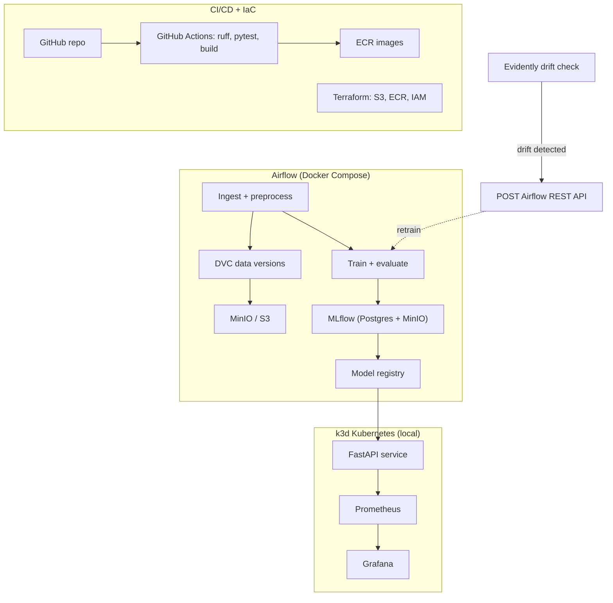

# End-to-End MLOps Pipeline

A production-grade MLOps reference implementation: reproducible data and training
pipelines, experiment tracking, CI/CD, monitored model serving on Kubernetes, and a
closed loop that retrains automatically when drift is detected.

The ML model is deliberately simple - LightGBM on tabular data, training in under 30
seconds. The engineering around it is the project: orchestration, versioning,
automation, observability, and the switches that take the same code from a laptop to
AWS with near-zero cloud spend.

## Architecture



## Tech stack

| Concern | Tool |
| --- | --- |
| Orchestration | Apache Airflow 3.x (Docker Compose) |
| Data & pipeline versioning | DVC — MinIO locally, S3 in cloud |
| Experiment tracking & registry | MLflow (Postgres backend, server-proxied artifacts) |
| Serving | FastAPI container on k3d Kubernetes (Helm) |
| Infrastructure as code | Terraform — S3, ECR, least-privilege IAM |
| CI/CD | GitHub Actions — lint, test, buildx, push to ECR |
| Monitoring | Evidently (drift) + Prometheus / Grafana (API telemetry) |
| GitOps (planned) | ArgoCD sync into k3d |

## Design decisions

- **Local-first, cloud-ready.** Everything runs on Docker Compose and k3d; the AWS
  footprint is limited to S3, ECR, and a one-off ECS Fargate demo. MinIO speaks the S3
  API, so the storage code path is identical locally and in the cloud — switching is an
  endpoint and credentials, not a rewrite.
- **Kubernetes over managed container services.** Serving runs on k3d with real
  Deployment/Service/HPA manifests and a Helm chart — portable skills and
  production-shaped configuration instead of a proprietary abstraction.
- **MLflow on Postgres, not SQLite.** Parallel Airflow tasks write concurrently;
  SQLite locks, Postgres doesn't.
- **Server-proxied artifacts.** Clients log to MLflow without holding any storage
  credentials — the server brokers all artifact traffic.
- **Lightweight model on purpose.** Fast training keeps the feedback loop on the
  pipeline, where the engineering value is.

## Cloud footprint and cost

The AWS layer is deliberately minimal and fully described in `infra/terraform/`:

| Resource | Purpose | Cost when idle |
| --- | --- | --- |
| S3 bucket | DVC remote | ~$0.02/GB-month, lifecycle rules cap growth |
| ECR repository | Inference API images | ~$0.10/GB-month, last 10 images retained |
| GitHub OIDC provider + IAM role | Keyless CI authentication | free |

No always-on compute is provisioned. The ECS Fargate demo in Phase 6 is applied and
destroyed in a single session.

Everything runs locally without an AWS account: MinIO stands in for S3, and k3d for
managed Kubernetes.

```bash
cd infra/terraform && terraform init && terraform plan
```

**Security posture:** CI authenticates via GitHub OIDC — no long-lived AWS keys exist
anywhere in the repo or in GitHub secrets. The IAM role is scoped to one repository, one
ECR repository, and one S3 bucket.

## Roadmap

| Phase | Scope | Status |
| --- | --- | --- |
| 1 | Local infra: Compose stack (MinIO, Postgres, MLflow, Airflow), Terraform, DVC, ingestion DAG | 🔨 in progress — Compose stack and AWS foundation done |
| 2 | Preprocess/train DAGs, MLflow tracking, model registry | planned |
| 3 | FastAPI serving on k3d, multi-stage Docker build, tests | planned |
| 4 | CI/CD with GitHub Actions | planned |
| 5 | Drift detection + automated retraining loop | planned |
| 6 | Hardening: secrets, IAM, security checklist, cost audit | planned |
| 7 | ArgoCD GitOps | planned |

## Quickstart (local)

Prerequisites: Docker Desktop, conda, [uv](https://github.com/astral-sh/uv).
For the optional AWS layer: Terraform ≥ 1.11 and the AWS CLI.

Python lives in the conda env `mlops-pipeline` (3.10); uv resolves and installs the
locked dependency set into it rather than creating a project `.venv`.

One-time, so uv targets the conda env instead of creating its own:

```bash
conda create -n mlops-pipeline python=3.10
conda env config vars set UV_PROJECT_ENVIRONMENT="$(conda run -n mlops-pipeline \
  python -c 'import sys; print(sys.prefix)')" -n mlops-pipeline
```

Then:

```bash
conda activate mlops-pipeline
uv sync                     # installs into the conda env

cp .env.example .env        # set local passwords
docker compose up -d --build
python scripts/smoke_mlflow.py
```

UIs: MLflow at http://localhost:5001 · MinIO console at http://localhost:9001

## Repository layout

```
├── dags/                # Airflow DAGs
├── src/mlops_pipeline/  # shared Python package
├── docker/              # service images and init scripts
├── infra/terraform/     # AWS resources (S3, ECR, IAM)
├── scripts/             # smoke tests and utilities
├── tests/
├── docs/                # phase specs
└── docker-compose.yml
```

## Production gaps and how they close

This repo runs on local stand-ins where a real deployment would use managed services.
Each gap is tracked and closed (or documented) in Phase 6:

- Secrets: `.env` locally → AWS Secrets Manager / SSM Parameter Store, K8s Secrets
  in-cluster.
- Credentials: MinIO root creds reused across services locally → one scoped service
  account / IAM role per service.
- Images: `latest` tags locally → digest-pinned images in production.
- State: single-node Postgres and MinIO → managed RDS and S3 with backups and
  lifecycle policies.
- Terraform state is local; production uses an S3 backend with native locking
  (`use_lockfile = true`), one state file per environment.
- Bucket encryption is SSE-S3; regulated workloads use customer-managed KMS keys for
  rotation, per-key policies, and CloudTrail on key usage.
- The CI role trusts any ref in the repository; tightening the `sub` condition to
  `refs/heads/main` blocks fork-PR access.
